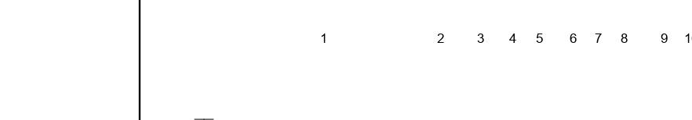
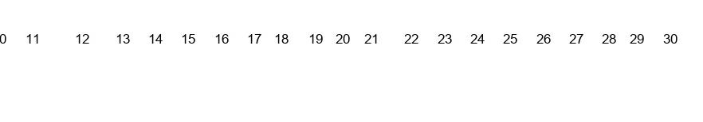
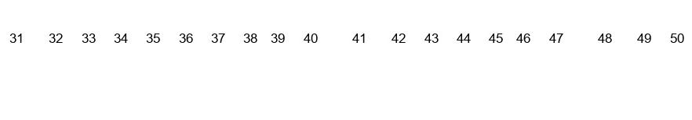
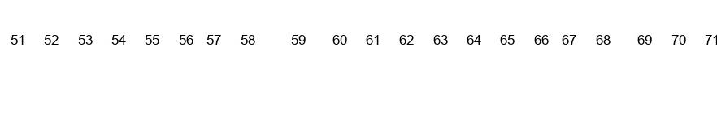
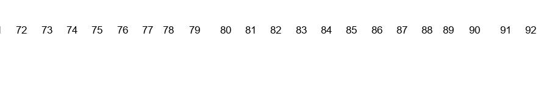
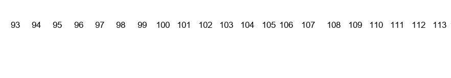
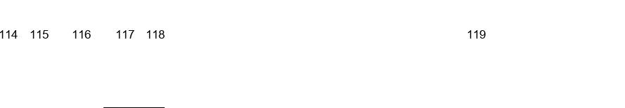
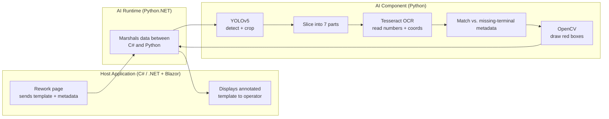

# Detecting and Highlighting Terminals on Digital Templates Using AI

> A hybrid computer-vision and AI system that automatically detects **missing terminals (clamps)** on digital control-cabinet templates and highlights them for rework operators — turning a slow, error-prone manual inspection into a sub-one-minute automated check.

<p align="left">
  
  
  
  
  
  
</p>

This repository accompanies my Master's thesis in **Software Engineering for Industrial Applications**. It implements a **Detection & Highlighting (D&H) system** that inspects the digital template (blueprint) of a manufacturing order, works out which terminals are missing, and draws red boxes around them so an operator can fix the order quickly.

---

## Table of Contents

- [Background](#background)
- [What Problem This Solves](#what-problem-this-solves)
- [How It Works](#how-it-works)
- [Pipeline in Pictures](#pipeline-in-pictures)
- [Architecture](#architecture)
- [Tech Stack](#tech-stack)
- [Results](#results)
- [Installation](#installation)
- [Usage](#usage)
- [Project Structure](#project-structure)
- [Limitations & Future Work](#limitations--future-work)
- [Author](#author)
- [License](#license)

---

## Background

In the manufacturing of electrical control cabinets, robotic arms place **terminals** (also called *clamps*) onto a DIN rail according to a pre-generated digital template. After the robotic step, a human operator has to verify that every terminal was placed correctly by comparing the static template against the order's metadata — a manual, repetitive task that is slow, hard to scale, and prone to human error.

Because the process works from **already-generated digital templates** (not a live camera feed), a classic camera-based vision system cannot be applied directly. This project instead runs entirely on the existing template images plus the order metadata, which makes inspection faster, cheaper, and more reliable.

## What Problem This Solves

The D&H system was built to:

- **Detect** missing terminals on a digital template by cross-checking it against the order's metadata.
- **Highlight** the missing terminals with red bounding boxes so they are obvious at a glance.
- **Integrate** into an existing rework workflow, triggering automatically when an operator opens an order's rework page.
- **Return results fast** — the full detect-and-highlight cycle for one order completes in **under a minute**.

## How It Works

The system is a **hybrid pipeline**: an object-detection model finds *where* the terminal-position numbers live on the template, and an OCR model reads *what those numbers are*. The two signals are fused to locate and mark the missing terminals.

1. **Object detection (YOLOv5).** A YOLOv5 model — trained from scratch on annotated templates — locates the strip of the template that contains the terminal **position numbers**. Only detections above a confidence threshold of `0.80` are kept, which suppresses noise. The detected region is then cropped out of the full template.

2. **Slicing.** The full number strip is long and dense, which hurts OCR accuracy. The cropped strip is therefore sliced programmatically into **seven vertical segments** so each piece is clean and readable.

3. **OCR (Tesseract).** Each segment is pre-processed (grayscale + adaptive thresholding) and passed to Tesseract OCR, which returns each **position number together with its X, Y coordinates**. The seven slices are then stitched back together in code so the coordinates map back onto the *original* template.

4. **Matching.** The list of numbers the OCR extracted is compared against the metadata list of **missing** terminal positions. Where a missing position matches an OCR-read number, its coordinates are handed off for annotation.

5. **Annotation (OpenCV).** OpenCV draws red bounding boxes at the matched coordinates on the original template, producing an annotated image that clearly shows the operator which terminals still need to be placed.

6. **Return.** The annotated template is passed back to the host application and displayed to the operator alongside a list of the missing positions.

## Pipeline in Pictures

**1. Input — a digital order template**

The system starts from a static template describing where every terminal should sit on the DIN rail.


**2. Cropping — the cropped strip from the digital template for OCR**

The detected object class is cropped fro slicing and giving it to OCR as input so that Itcan read an give the x, y coordinates of the detected numbers. 


**3. Slicing — the cropped strip is split into 7 segments for OCR**

Each segment is small and clean, which gives Tesseract far better accuracy than reading the whole strip at once.









**4. Detection — YOLOv5 locates the position-number region**

The trained model detects the region containing the terminal position numbers (shown highlighted) and crops it for further processing.


**5. Output — missing terminals highlighted**

After matching OCR results against the metadata, the missing terminals are marked with red boxes on the original template.


## Architecture

The solution is split into three loosely-coupled components so any single part (a model, the OCR logic, the annotation step) can be swapped or upgraded independently:



- **Host application** — the existing desktop app. It provides the template image and metadata, and renders the annotated result.
- **AI Runtime** — a `Python.NET` bridge that lets the C# host call into Python and run the models in-process, with no network round-trip.
- **AI Component** — the Python module containing the two AI models (YOLOv5, Tesseract OCR) and the OpenCV/NumPy post-processing logic.

## Tech Stack

| Layer | Technology |
|-------|-----------|
| Object detection | YOLOv5 (Ultralytics, PyTorch) |
| Text recognition | Tesseract OCR (via `pytesseract`) |
| Image processing | OpenCV, NumPy |
| C# ↔ Python bridge | Python.NET (`pythonnet`) |
| Host application | C# / .NET, Blazor |
| Annotation tooling | LabelImg (for building the training set) |

## Results

The models and the end-to-end pipeline were evaluated on real order templates.

**YOLOv5 (position-number detection)**

| Metric | Value |
|--------|-------|
| Precision | ~0.995 |
| Recall | ~0.996 |
| mAP@0.5 | 0.993 |
| Training set | 231 annotated templates (70% train / 20% val / 10% test) |

**OCR & end-to-end**

| Metric | Value |
|--------|-------|
| OCR position-read accuracy | > 95% |
| End-to-end detect + highlight time | < 1 minute (44 s in a representative run) |
| Overall system accuracy (across test cases) | > 90% |

The precision, recall, and F1 curves all sit very close to `1.0` at low-to-mid confidence thresholds, with no significant gap between training and validation loss (i.e. no overfitting observed).

## Installation

> The core inspection pipeline is the **Python AI module**. The C# host application integrates it via Python.NET. The steps below set up the Python side, which you can run and test on its own.

### Prerequisites

- **Python 3.13**
- **Git** and **[Git LFS](https://git-lfs.com/)** — the trained weights and sample templates are large binary files, so clone with LFS enabled
- **Tesseract OCR** installed as a system binary (the `pytesseract` package is only a wrapper around it)
  - Windows: download the installer from the [Tesseract at UB Mannheim builds](https://github.com/UB-Mannheim/tesseract/wiki)
  - macOS: `brew install tesseract`
  - Linux: `sudo apt install tesseract-ocr`
- *(Optional, for retraining)* an NVIDIA GPU with CUDA — inference also runs on CPU

### Steps

```bash
# 1. Clone (with Git LFS so the weights come down, not just pointers)
git lfs install
git clone https://github.com/arslanzafar-pro/Detecting-And-Highlighting-Terminals-On-Digital-Templates-Using-Artificial-Intelligence.git
cd Detecting-And-Highlighting-Terminals-On-Digital-Templates-Using-Artificial-Intelligence

# 2. Create and activate a virtual environment
python -m venv .venv

#    Windows (PowerShell):
.venv\Scripts\Activate.ps1
#    macOS / Linux:
source .venv/bin/activate

# 3. Install Python dependencies
pip install -r requirements.txt
```

If a `requirements.txt` isn't present yet, install the core packages directly:

```bash
pip install torch torchvision opencv-python numpy pytesseract pythonnet ultralytics
```

> **Tesseract path note:** if Python can't find the Tesseract binary, point to it explicitly in your script, e.g.
> `pytesseract.pytesseract.tesseract_cmd = r"C:\Program Files\Tesseract-OCR\tesseract.exe"`

## Usage

> Replace the script/entry-point names below with the actual filenames in this repo.

**Run detection + highlighting on a single template:**

```bash
python detect.py --template path/to/order_template.jpg --weights weights/best.pt
```

**Retrain the YOLOv5 detector** (from the YOLOv5 directory, with your dataset configured in the `.yaml`):

```bash
python train.py --img 640 --epochs 500 --data coco128.yaml --weights yolov5s.pt
```

Training used a single class (`OneClassNumbers`) representing the terminal-position region, `640×640` input, and `yolov5s.pt` as the starting weights. The best checkpoint (`best.pt`) is the one used for inference.

## Project Structure

```
.
├── assets/
│   └── images/              # README illustrations
├── weights/                 # trained YOLOv5 weights (best.pt) — tracked via Git LFS
├── <python-ai-module>/      # detection, slicing, OCR, and annotation logic
├── <yolov5>/                # YOLOv5 training/inference setup
├── requirements.txt
└── README.md
```

## Limitations & Future Work

- **Blurring of irrelevant data** was specified but is not yet fully working — the annotated output currently keeps the surrounding template visible rather than blurring everything except the missing terminals.
- **Newer detector** — YOLOv5 was chosen for stability; the pipeline can be retrained on a newer YOLO release for better speed/accuracy once one is stable for production.
- **Adaptive OCR** — the OCR currently reads numeric positions from clean, well-structured templates. It could be extended to handle alphabetic text, lower-contrast layouts, and new template formats, potentially assisted by an LLM.
- **Continuous learning** — feeding error logs back into the models would let them adapt to new template types over time.
- **Hardware & scaling** — a stronger GPU and a load balancer would help the system handle many concurrent inspection requests.

## Author

**Arslan Zafar** — Master of Software Engineering for Industrial Applications

[](https://www.linkedin.com/in/arslanzafar-pro/)

## License

https://docs.ultralytics.com/models
> **Heads-up:** this project builds on **Ultralytics YOLOv5**, which is distributed under **AGPL-3.0**. If you redistribute a derivative that includes YOLOv5, your combined work may need to comply with AGPL-3.0 terms. Review Ultralytics' licensing before publishing under a different license.
