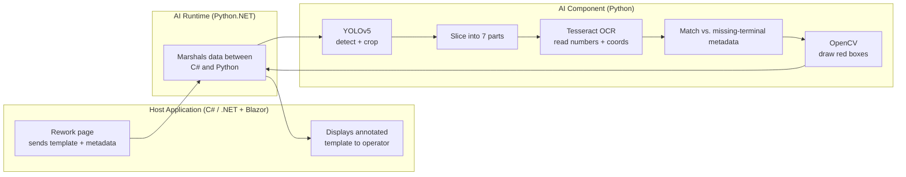

# Architecture

The solution is split into **three loosely-coupled components** so any single part — a model, the OCR logic, the annotation step — can be swapped or upgraded independently.

## The three components

### 1. Host application — C# / .NET + Blazor
The existing desktop application. It owns the rework workflow: it provides the **template image** and the **order metadata**, and it renders the **annotated result** back to the operator. The AI inspection is triggered automatically when the operator opens an order's rework page.

### 2. AI Runtime — Python.NET bridge
A [`Python.NET`](https://pythonnet.github.io/) bridge that lets the C# host **call into Python and run the models in-process**. Because it runs in-process, there is **no network round-trip** — data is marshalled directly between the C# and Python runtimes, keeping the end-to-end latency low.

### 3. AI Component — Python
The Python module containing the two AI models (**YOLOv5** for detection, **Tesseract OCR** for reading) plus the **OpenCV / NumPy** post-processing logic (slicing, coordinate mapping, matching, and annotation).

## Why this split matters

- **Independent upgrades** — the detector can be retrained or replaced (e.g. a newer YOLO release) without touching the host or the OCR logic.
- **In-process performance** — the Python.NET bridge avoids the overhead and failure modes of a separate service or REST call.
- **Clear responsibilities** — the host handles UI and workflow, the runtime handles interop, and the AI component handles the actual detection and highlighting.

---

**Next:** [Tech Stack →](Tech-Stack)
